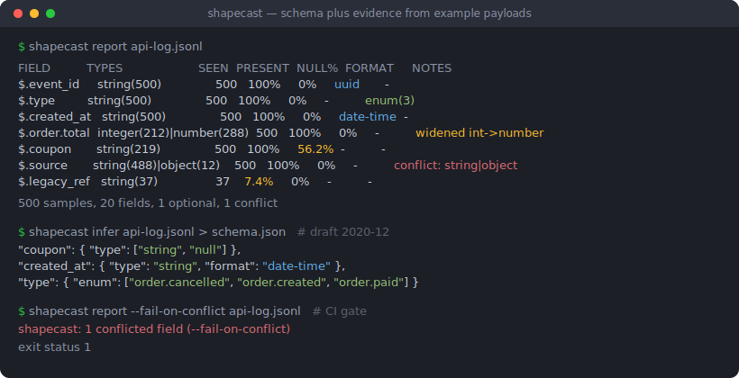
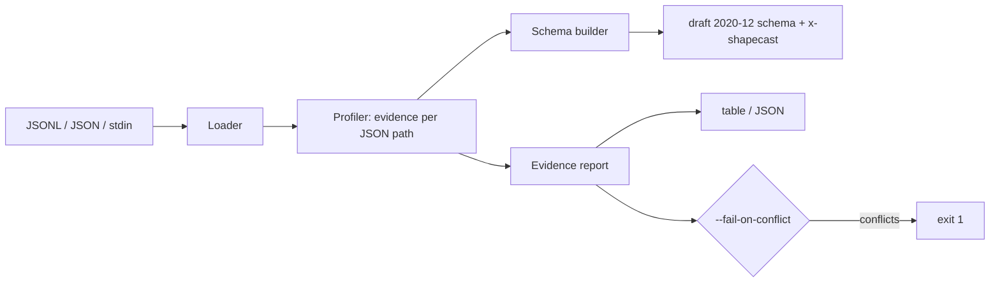

# shapecast

[English](README.md) | [中文](README.zh.md) | [日本語](README.ja.md)

[](LICENSE) [](CHANGELOG.md) [](pyproject.toml)  [](CONTRIBUTING.md)

**shapecast：サンプルペイロードから JSON Schema を推論し、その根拠を報告するオープンソース CLI —— 全サンプルを横断した、フィールドごとの出現回数・型コンフリクト・null 率の統計付き。**



```bash
git clone https://github.com/JaydenCJ/shapecast && cd shapecast && pip install -e .
```

> **プレリリース：** shapecast はまだ PyPI に公開されていません。初回リリースまでは [JaydenCJ/shapecast](https://github.com/JaydenCJ/shapecast) をクローンし、リポジトリのルートで `pip install -e .` を実行してください。ランタイム依存はゼロ —— 標準ライブラリだけで動きます。

## なぜ shapecast？

ドキュメントのない内部 API はどこにでもあります：他チームが出したサービス、ベンダーの webhook、現メンバーの誰よりも古いモバイルクライアント。よくあるやり方はレスポンスを 1 件だけ型ジェネレータに食わせて結果を信じること —— しかし単一サンプルからは、`coupon` が 58% の確率で null であること、`legacy_ref` が 500 イベント中 2 回しか現れないこと、`source` が普段は文字列なのにあるコードパスだけオブジェクトを送ることは分かりません。統合を壊すのはまさにこうした事実であり、それらは大量サンプルを*横断*して初めて存在します。shapecast はキャプチャ全体をワンパスでプロファイルし、2 つの成果物を出します：すべてのキーワードがデータに裏付けられた保守的な draft 2020-12 スキーマと、各フィールドをどこまで信じてよいかを示す根拠レポートです。型ジェネレータは型を出力する；shapecast は証拠を提示する。

|  | shapecast | quicktype | GenSON | datamodel-code-generator |
|---|---|---|---|---|
| 主な出力 | JSON Schema + フィールド別根拠レポート | 20+ 言語の型/コード | JSON Schema | pydantic / dataclass コード |
| 出現回数・存在率・null 率の統計 | あり。フィールド別、全サンプル横断 | なし | なし | なし |
| キー欠落 vs. null 値 | 別々に集計（異なる API 挙動のため） | 「optional」に統合 | 統合 | 統合 |
| 型コンフリクト | 件数付きでフラグ；CI ゲートは 1 で終了 | 暗黙にユニオン化 | 暗黙にユニオン化（`anyOf`） | ユニオンまたはエラー |
| enum / format の判定 | 根拠の閾値制（反復出現 + 全数カバー必須） | 与えられた実行に基づくヒューリスティック | なし | 入力スキーマから取得 |
| ランタイム依存 | 0 | Node.js + npm 依存ツリー | 0 | 10+ の Python パッケージ |

<sub>比較は 2026-07 時点の各上流ドキュメントに基づく：quicktype はサンプルから型と enum を推論するが統計は報告しない；GenSON 1.3 は観測した型をカウントなしでスキーマへ統合する；datamodel-code-generator はスキーマ/サンプルを消費してモデルコードを生成する。shapecast の依存数は [pyproject.toml](pyproject.toml) の `dependencies = []` そのもの。</sub>

## 特徴

- **スキーマに証拠を添えて** —— 出力される draft 2020-12 スキーマのすべてのキーワードはサンプル統計に裏付けられる；`--evidence` は生の数値を `x-shapecast` 注釈として埋め込み、バリデータはこれを無視する。
- **存在と null 可能性は別の故障モード** —— ときどき*欠落する*キーと、ときどき *null* になるキーでは必要な処理コードが違う。だから shapecast は両者を別々に数え、両方の率を報告する。
- **コンフリクトが終了コードになる** —— 488 サンプルで文字列、12 サンプルでオブジェクトのフィールドは正確な件数付きでフラグされ、`report --fail-on-conflict` は 1 で終了。CI がペイロードストリームの形状ドリフトを見張れる。
- **閾値制の enum と format** —— `enum` は完全で小さな値集合と全値の反復出現を要求；`format`（uuid・date-time・email・ipv4 など）は全文字列サンプルの一致を要求。たまたまの 1 値から断定しない。
- **ログをそのまま食べる** —— JSON Lines、単一ドキュメント、トップレベル配列、複数ファイル、stdin；自動判別と `--format` 上書き、巨大キャプチャ向けの `--max-samples`、ファイルと行番号を特定するパースエラー。
- **依存ゼロ、ネットワークゼロ** —— 純標準ライブラリ、完全オフライン、テレメトリなし；テストは 92 個の決定的テストとエンドツーエンドのスモークスクリプト。

## クイックスタート

インストール：

```bash
git clone https://github.com/JaydenCJ/shapecast && cd shapecast && pip install -e .
```

キャプチャしたペイロードを数件 `samples.jsonl` に保存します（1 行 1 JSON ドキュメント）：

```json
{"id": 1, "name": "ana", "plan": "free", "last_login": "2026-07-01T08:30:00Z"}
{"id": 2, "name": "bo", "plan": "pro", "last_login": null}
{"id": 3, "name": "cy", "plan": "free"}
{"id": 4, "name": "di", "plan": "pro", "last_login": "2026-07-11T22:04:10Z"}
```

スキーマを推論 —— `plan` は enum に（両方の値が反復出現）、`last_login` は nullable *かつ* optional に。どの結論も単一サンプル由来ではありません（以下の出力は空白を詰めています）：

```bash
shapecast infer samples.jsonl
```

```text
{
  "$schema": "https://json-schema.org/draft/2020-12/schema",
  "properties": {
    "id": { "type": "integer" },
    "last_login": { "format": "date-time", "type": ["string", "null"] },
    "name": { "type": "string" },
    "plan": { "enum": ["free", "pro"], "type": "string" }
  },
  "required": ["id", "name", "plan"],
  "type": "object"
}
```

続けてその背後にある根拠を確認します（実際にキャプチャした出力）：

```bash
shapecast report samples.jsonl
```

```text
FIELD         TYPES       SEEN  PRESENT  NULL%  FORMAT     NOTES
$             object(4)   4     -        0%     -          -
$.id          integer(4)  4     100%     0%     -          -
$.name        string(4)   4     100%     0%     -          -
$.plan        string(4)   4     100%     0%     -          enum(2)
$.last_login  string(2)   3     75.0%    33.3%  date-time  -

4 samples, 5 fields, 1 optional, 0 conflicts
```

`PRESENT` は親オブジェクト内にそのキーが存在する頻度；`NULL%` は存在時に null である頻度 —— ここでは 75% と 33.3%。`{"last_login": null}` と `last_login` の欠落は別の挙動だからです。意図的な型コンフリクトを含むより大きなサンプルログは [`examples/`](examples/README.md) にあります。

## CLI リファレンス

2 つのサブコマンドはワンパスの同じプロファイルを共有します。`shapecast infer [FILE...]` はスキーマを、`shapecast report [FILE...]` は根拠テーブル（または `--json`）を出力します。ファイルは `.jsonl`/`.ndjson`、`.json`、または stdin を表す `-` が使えます。

| キー | 既定値 | 効果 |
|---|---|---|
| `--format` | `auto` | 入力の分割方式：`jsonl`、`json`（1 サンプル）、`array`（トップレベル配列 = 複数サンプル） |
| `--max-samples N` | `0`（全件） | 全入力を通算して N サンプルで打ち切り |
| `--required-threshold R` | `1.0` | `infer` のみ：キーが `required` に入るための最低存在率 |
| `--enum-limit N` | `10` | enum 検出の最大異なり値数；`0` で無効化 |
| `--no-formats` | オフ | 文字列 format 検出を無効化 |
| `--title T` | なし | `infer` のみ：スキーマの `title` を設定 |
| `--evidence` | オフ | `infer` のみ：各サブスキーマに `x-shapecast` 統計を埋め込む |
| `--indent N` | `2` | `infer` のみ：出力スキーマの JSON インデント幅 |
| `--json` | オフ | `report` のみ：機械可読レポート |
| `--fail-on-conflict` | オフ | `report` のみ：非互換型が混在するフィールドがあれば 1 で終了 |

終了コード：`0` 成功 · `1` `--fail-on-conflict` 下でコンフリクト検出 · `2` 入力不能。根拠からスキーマキーワードへの完全なマッピング —— そして shapecast が意図的に決して出力しないもの（`additionalProperties: false`、サンプル由来の `minimum`/`maxLength`）—— は [`docs/evidence-model.md`](docs/evidence-model.md) に規定しています。

## 検証

このリポジトリは CI を同梱しません；上記の主張はすべてローカル実行で検証されています。本リポジトリのチェックアウトから再現できます：

```bash
pip install -e '.[dev]' && pytest && bash scripts/smoke.sh
```

出力（実際の実行からの転記、`...` で省略）：

```text
92 passed in 0.78s
...
[smoke] bad input rejected with file:line
SMOKE OK
```

## アーキテクチャ



## ロードマップ

- [x] ワンパスプロファイラ、根拠に裏付けられたスキーマ生成、フィールド別レポート、コンフリクト CI ゲート、厳格な format/enum 検出、CLI（v0.1.0）
- [ ] PyPI 公開（`pip install shapecast`）
- [ ] `shapecast diff`：2 つのキャプチャを比較し、デプロイ間の形状ドリフトを報告
- [ ] 数 GB 級ログ向けのストリーミング/リザーバサンプリング
- [ ] OpenAPI 3.1 コンポーネント出力
- [ ] コンフリクトフィールドを型ユニオンの代わりに `anyOf` へ分割するオプション

全リストは [open issues](https://github.com/JaydenCJ/shapecast/issues) を参照してください。

## コントリビュート

コントリビュート歓迎です —— [good first issue](https://github.com/JaydenCJ/shapecast/issues?q=is%3Aissue+is%3Aopen+label%3A%22good+first+issue%22) から始めるか、[discussion](https://github.com/JaydenCJ/shapecast/discussions) を開いてください。開発環境の構築は [CONTRIBUTING.md](CONTRIBUTING.md) をご覧ください。

## ライセンス

[MIT](LICENSE)
