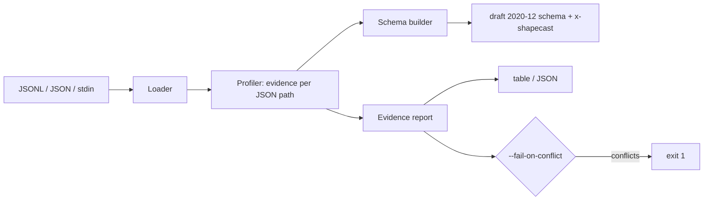

# shapecast

[English](README.md) | [中文](README.zh.md) | [日本語](README.ja.md)

[](LICENSE) [](CHANGELOG.md) [](pyproject.toml)  [](CONTRIBUTING.md)

**shapecast：an open-source CLI that infers JSON Schema from example payloads and reports the evidence — per-field occurrence counts, type conflicts, and nullability rates across all your samples.**


```bash
git clone https://github.com/JaydenCJ/shapecast && cd shapecast && pip install -e .
```

> **Pre-release:** shapecast is not yet published to PyPI. Until the first release, clone [JaydenCJ/shapecast](https://github.com/JaydenCJ/shapecast) and run `pip install -e .` from the repository root. Zero runtime dependencies — the standard library is all it needs.

## Why shapecast?

Undocumented internal APIs are everywhere: the service another team ships, the vendor webhook, the mobile client that predates everyone on the current team. The usual move is to feed one response into a type generator and trust the result — but one sample cannot tell you that `coupon` is null 58% of the time, that `legacy_ref` only appears in 2 of 500 events, or that `source` is a string except when one code path sends an object. Those are exactly the facts that break integrations, and they only exist *across* many samples. shapecast profiles your whole capture in one pass and emits two things: a conservative draft 2020-12 schema in which every keyword is backed by the data, and an evidence report that tells you how sure to be about each field. Type generators emit types; shapecast shows receipts.

|  | shapecast | quicktype | GenSON | datamodel-code-generator |
|---|---|---|---|---|
| Primary output | JSON Schema + per-field evidence report | types/code for 20+ languages | JSON Schema | pydantic / dataclass code |
| Occurrence, presence and null-rate statistics | Yes, per field, across all samples | No | No | No |
| Missing key vs. null value | Counted separately (different API behaviors) | Merged into "optional" | Merged | Merged |
| Type conflicts | Flagged with counts; CI gate exits 1 | Silently unioned | Silently unioned (`anyOf`) | Union or error |
| Enum / format claims | Evidence-thresholded (repetition + full coverage required) | Heuristic from the given run | None | Taken from input schema |
| Runtime dependencies | 0 | Node.js + npm dependency tree | 0 | 10+ Python packages |

<sub>Comparison reflects upstream documentation as of 2026-07: quicktype infers types and enums from samples but reports no statistics; GenSON 1.3 merges observed types into schemas without counts; datamodel-code-generator consumes schemas/samples to emit model code. shapecast's dependency count is `dependencies = []` in [pyproject.toml](pyproject.toml).</sub>

## Features

- **Schema plus receipts** — every keyword in the emitted draft 2020-12 schema is justified by sample statistics; `--evidence` embeds the raw numbers as `x-shapecast` annotations that validators ignore.
- **Presence and nullability are different failure modes** — a key that is sometimes *absent* and a key that is sometimes *null* need different handling code, so shapecast counts them separately and reports both rates.
- **Conflicts become exit codes** — a field that is a string in 488 samples and an object in 12 is flagged with exact counts, and `report --fail-on-conflict` exits 1 so CI can watch a payload stream for shape drift.
- **Evidence-thresholded enums and formats** — `enum` requires a complete, small value set where every value repeats; `format` (uuid, date-time, email, ipv4, …) requires every string sample to match. No claims from one lucky value.
- **Feeds on logs as they are** — JSON Lines, single documents, top-level arrays, multiple files, stdin; auto-detected with a `--format` override, `--max-samples` for huge captures, and parse errors that name the exact file and line.
- **Zero dependencies, zero network** — pure standard library, fully offline, no telemetry; the suite is 92 deterministic tests plus an end-to-end smoke script.

## Quickstart

Install:

```bash
git clone https://github.com/JaydenCJ/shapecast && cd shapecast && pip install -e .
```

Save a few captured payloads as `samples.jsonl` (one JSON document per line):

```json
{"id": 1, "name": "ana", "plan": "free", "last_login": "2026-07-01T08:30:00Z"}
{"id": 2, "name": "bo", "plan": "pro", "last_login": null}
{"id": 3, "name": "cy", "plan": "free"}
{"id": 4, "name": "di", "plan": "pro", "last_login": "2026-07-11T22:04:10Z"}
```

Infer the schema — `plan` becomes an enum (both values repeat), `last_login` is nullable *and* optional, and neither claim comes from a single sample (output below is whitespace-condensed):

```bash
shapecast infer samples.jsonl
```

```text
{
  "$schema": "https://json-schema.org/draft/2020-12/schema",
  "properties": {
    "id": { "type": "integer" },
    "last_login": { "format": "date-time", "type": ["string", "null"] },
    "name": { "type": "string" },
    "plan": { "enum": ["free", "pro"], "type": "string" }
  },
  "required": ["id", "name", "plan"],
  "type": "object"
}
```

Then ask for the evidence behind it (real captured output):

```bash
shapecast report samples.jsonl
```

```text
FIELD         TYPES       SEEN  PRESENT  NULL%  FORMAT     NOTES
$             object(4)   4     -        0%     -          -
$.id          integer(4)  4     100%     0%     -          -
$.name        string(4)   4     100%     0%     -          -
$.plan        string(4)   4     100%     0%     -          enum(2)
$.last_login  string(2)   3     75.0%    33.3%  date-time  -

4 samples, 5 fields, 1 optional, 0 conflicts
```

`PRESENT` is how often the key exists in its parent object; `NULL%` is how often it is null when present — 75% and 33.3% here, because `{"last_login": null}` and a missing `last_login` are different behaviors. A larger example log with a deliberate type conflict lives in [`examples/`](examples/README.md).

## CLI reference

Two subcommands share the same one-pass profile. `shapecast infer [FILE...]` prints the schema; `shapecast report [FILE...]` prints the evidence table (or `--json`). Files may be `.jsonl`/`.ndjson`, `.json`, or `-` for stdin.

| Key | Default | Effect |
|---|---|---|
| `--format` | `auto` | Input splitting: `jsonl`, `json` (one sample), `array` (top-level array = samples) |
| `--max-samples N` | `0` (all) | Stop after N samples across all inputs |
| `--required-threshold R` | `1.0` | `infer` only: minimum presence rate for a key to be `required` |
| `--enum-limit N` | `10` | Max distinct values for enum detection; `0` disables |
| `--no-formats` | off | Disable string format detection |
| `--title T` | none | `infer` only: set the schema `title` |
| `--evidence` | off | `infer` only: embed `x-shapecast` statistics in every subschema |
| `--indent N` | `2` | `infer` only: JSON indentation of the emitted schema |
| `--json` | off | `report` only: machine-readable report |
| `--fail-on-conflict` | off | `report` only: exit 1 if any field mixes incompatible types |

Exit codes: `0` success · `1` conflicts found under `--fail-on-conflict` · `2` unusable input. The full mapping from evidence to schema keywords — and what shapecast deliberately never emits (`additionalProperties: false`, sample-derived `minimum`/`maxLength`) — is specified in [`docs/evidence-model.md`](docs/evidence-model.md).

## Verification

This repository ships no CI; every claim above is verified by local runs. Reproduce them from a checkout of this repository:

```bash
pip install -e '.[dev]' && pytest && bash scripts/smoke.sh
```

Output (copied from a real run, truncated with `...`):

```text
92 passed in 0.78s
...
[smoke] bad input rejected with file:line
SMOKE OK
```

## Architecture



## Roadmap

- [x] One-pass profiler, evidence-backed schema generation, per-field report, conflict CI gate, strict format/enum detection, CLI (v0.1.0)
- [ ] PyPI release with `pip install shapecast`
- [ ] `shapecast diff`: compare two captures and report shape drift between deploys
- [ ] Streaming/reservoir sampling for multi-gigabyte logs
- [ ] OpenAPI 3.1 component output
- [ ] Optional `anyOf` splitting for conflicted fields instead of type unions

See the [open issues](https://github.com/JaydenCJ/shapecast/issues) for the full list.

## Contributing

Contributions are welcome — start with a [good first issue](https://github.com/JaydenCJ/shapecast/issues?q=is%3Aissue+is%3Aopen+label%3A%22good+first+issue%22) or open a [discussion](https://github.com/JaydenCJ/shapecast/discussions). See [CONTRIBUTING.md](CONTRIBUTING.md) for the development setup.

## License

[MIT](LICENSE)
