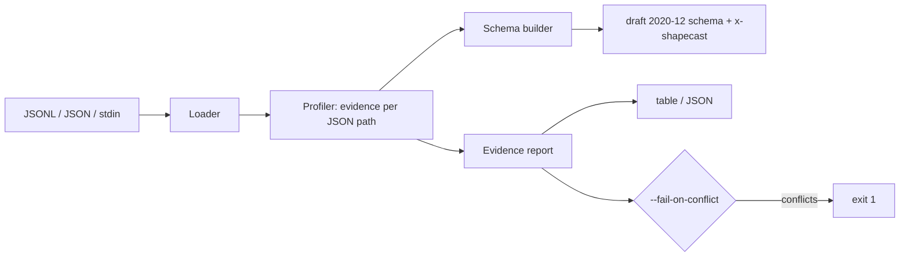

# shapecast

[English](README.md) | [中文](README.zh.md) | [日本語](README.ja.md)

[](LICENSE) [](CHANGELOG.md) [](pyproject.toml)  [](CONTRIBUTING.md)

**shapecast：开源 CLI，从示例载荷推断 JSON Schema 并报告证据 —— 跨越全部样本的逐字段出现次数、类型冲突与可空率统计。**


```bash
git clone https://github.com/JaydenCJ/shapecast && cd shapecast && pip install -e .
```

> **预发布：** shapecast 尚未发布到 PyPI。在首个正式版本之前，请克隆 [JaydenCJ/shapecast](https://github.com/JaydenCJ/shapecast) 并在仓库根目录运行 `pip install -e .`。零运行时依赖 —— 标准库就是全部所需。

## 为什么选择 shapecast？

无文档的内部 API 无处不在：别的团队交付的服务、供应商的 webhook、比现任团队所有人资历都老的移动客户端。惯常做法是把一条响应喂给类型生成器然后相信结果 —— 但单个样本无法告诉你 `coupon` 有 58% 的概率是 null、`legacy_ref` 在 500 个事件里只出现 2 次、`source` 通常是字符串但某条代码路径会发对象。恰恰是这些事实弄坏集成，而它们只存在于*跨越*大量样本的统计之中。shapecast 一趟扫描整个抓取集，产出两样东西：一份每个关键字都有数据背书的保守 draft 2020-12 schema，和一份告诉你对每个字段该有多少把握的证据报告。类型生成器输出类型；shapecast 亮出证据。

|  | shapecast | quicktype | GenSON | datamodel-code-generator |
|---|---|---|---|---|
| 主要输出 | JSON Schema + 逐字段证据报告 | 20+ 种语言的类型/代码 | JSON Schema | pydantic / dataclass 代码 |
| 出现次数、存在率与空值率统计 | 有，逐字段、覆盖全部样本 | 无 | 无 | 无 |
| 键缺失 vs. 值为 null | 分开计数（属于不同的 API 行为） | 合并为"可选" | 合并 | 合并 |
| 类型冲突 | 附带计数标出；CI 闸门以 1 退出 | 静默合并为联合类型 | 静默合并（`anyOf`） | 联合类型或报错 |
| enum / format 判定 | 证据阈值化（要求重复出现 + 全量覆盖） | 依给定运行的启发式 | 无 | 取自输入 schema |
| 运行时依赖 | 0 | Node.js + npm 依赖树 | 0 | 10+ 个 Python 包 |

<sub>对比基于 2026-07 时各上游文档：quicktype 从样本推断类型与枚举但不报告统计；GenSON 1.3 将观测到的类型合并进 schema 而不带计数；datamodel-code-generator 消费 schema/样本以生成模型代码。shapecast 的依赖数即 [pyproject.toml](pyproject.toml) 中的 `dependencies = []`。</sub>

## 特性

- **Schema 附带证据** —— 输出的 draft 2020-12 schema 里每个关键字都由样本统计背书；`--evidence` 把原始数字以 `x-shapecast` 注解形式嵌入，校验器会忽略它们。
- **存在与可空是两种不同的故障模式** —— 有时*缺失*的键和有时为 *null* 的键需要不同的处理代码，所以 shapecast 分开计数并同时报告两个比率。
- **冲突变成退出码** —— 在 488 个样本里是字符串、在 12 个样本里是对象的字段会连同精确计数被标出，`report --fail-on-conflict` 以 1 退出，让 CI 能盯住载荷流的形状漂移。
- **证据阈值化的 enum 与 format** —— `enum` 要求完整的小值集且每个值都重复出现；`format`（uuid、date-time、email、ipv4 等）要求每个字符串样本都匹配。绝不因一个碰巧的值就下结论。
- **直接吃下现成的日志** —— JSON Lines、单文档、顶层数组、多文件、stdin；自动检测并可用 `--format` 覆盖，`--max-samples` 应对巨型抓取，解析错误精确指明文件与行号。
- **零依赖、零网络** —— 纯标准库、完全离线、无遥测；测试套件为 92 个确定性测试外加端到端冒烟脚本。

## 快速上手

安装：

```bash
git clone https://github.com/JaydenCJ/shapecast && cd shapecast && pip install -e .
```

把几条抓到的载荷存成 `samples.jsonl`（每行一个 JSON 文档）：

```json
{"id": 1, "name": "ana", "plan": "free", "last_login": "2026-07-01T08:30:00Z"}
{"id": 2, "name": "bo", "plan": "pro", "last_login": null}
{"id": 3, "name": "cy", "plan": "free"}
{"id": 4, "name": "di", "plan": "pro", "last_login": "2026-07-11T22:04:10Z"}
```

推断 schema —— `plan` 成为 enum（两个值都重复出现），`last_login` 既可空*又*可选，且没有任何结论来自单个样本（下方输出经空白压缩）：

```bash
shapecast infer samples.jsonl
```

```text
{
  "$schema": "https://json-schema.org/draft/2020-12/schema",
  "properties": {
    "id": { "type": "integer" },
    "last_login": { "format": "date-time", "type": ["string", "null"] },
    "name": { "type": "string" },
    "plan": { "enum": ["free", "pro"], "type": "string" }
  },
  "required": ["id", "name", "plan"],
  "type": "object"
}
```

接着查看它背后的证据（真实抓取的输出）：

```bash
shapecast report samples.jsonl
```

```text
FIELD         TYPES       SEEN  PRESENT  NULL%  FORMAT     NOTES
$             object(4)   4     -        0%     -          -
$.id          integer(4)  4     100%     0%     -          -
$.name        string(4)   4     100%     0%     -          -
$.plan        string(4)   4     100%     0%     -          enum(2)
$.last_login  string(2)   3     75.0%    33.3%  date-time  -

4 samples, 5 fields, 1 optional, 0 conflicts
```

`PRESENT` 是该键在父对象中存在的频率；`NULL%` 是它存在时为 null 的频率 —— 此处分别是 75% 与 33.3%，因为 `{"last_login": null}` 与缺失 `last_login` 是两种不同行为。带有蓄意类型冲突的更大示例日志见 [`examples/`](examples/README.md)。

## CLI 参考

两个子命令共享同一趟扫描的 profile。`shapecast infer [FILE...]` 打印 schema；`shapecast report [FILE...]` 打印证据表（或 `--json`）。文件可以是 `.jsonl`/`.ndjson`、`.json`，或 `-` 表示 stdin。

| 键 | 默认值 | 效果 |
|---|---|---|
| `--format` | `auto` | 输入切分方式：`jsonl`、`json`（单样本）、`array`（顶层数组 = 多样本） |
| `--max-samples N` | `0`（全部） | 跨全部输入累计 N 个样本后停止 |
| `--required-threshold R` | `1.0` | 仅 `infer`：键进入 `required` 所需的最低存在率 |
| `--enum-limit N` | `10` | enum 检测的最大不同值数；`0` 表示禁用 |
| `--no-formats` | 关 | 禁用字符串 format 检测 |
| `--title T` | 无 | 仅 `infer`：设置 schema 的 `title` |
| `--evidence` | 关 | 仅 `infer`：在每个子 schema 中嵌入 `x-shapecast` 统计 |
| `--indent N` | `2` | 仅 `infer`：输出 schema 的 JSON 缩进宽度 |
| `--json` | 关 | 仅 `report`：机器可读的报告 |
| `--fail-on-conflict` | 关 | 仅 `report`：任一字段混用不兼容类型时以 1 退出 |

退出码：`0` 成功 · `1` 在 `--fail-on-conflict` 下发现冲突 · `2` 输入不可用。证据到 schema 关键字的完整映射 —— 以及 shapecast 刻意永不输出的内容（`additionalProperties: false`、来自样本的 `minimum`/`maxLength`）—— 详见 [`docs/evidence-model.md`](docs/evidence-model.md)。

## 验证

本仓库不附带 CI；以上所有断言均由本地运行验证。从本仓库的检出即可复现：

```bash
pip install -e '.[dev]' && pytest && bash scripts/smoke.sh
```

输出（摘自真实运行，以 `...` 截断）：

```text
92 passed in 0.78s
...
[smoke] bad input rejected with file:line
SMOKE OK
```

## 架构



## 路线图

- [x] 单趟 profiler、证据背书的 schema 生成、逐字段报告、冲突 CI 闸门、严格的 format/enum 检测、CLI（v0.1.0）
- [ ] 发布到 PyPI，支持 `pip install shapecast`
- [ ] `shapecast diff`：对比两次抓取，报告部署之间的形状漂移
- [ ] 面向数 GB 日志的流式/蓄水池采样
- [ ] OpenAPI 3.1 组件输出
- [ ] 冲突字段可选拆分为 `anyOf`，替代类型联合

完整清单见 [open issues](https://github.com/JaydenCJ/shapecast/issues)。

## 贡献

欢迎贡献 —— 从 [good first issue](https://github.com/JaydenCJ/shapecast/issues?q=is%3Aissue+is%3Aopen+label%3A%22good+first+issue%22) 开始，或发起一个 [discussion](https://github.com/JaydenCJ/shapecast/discussions)。开发环境搭建见 [CONTRIBUTING.md](CONTRIBUTING.md)。

## 许可证

[MIT](LICENSE)
